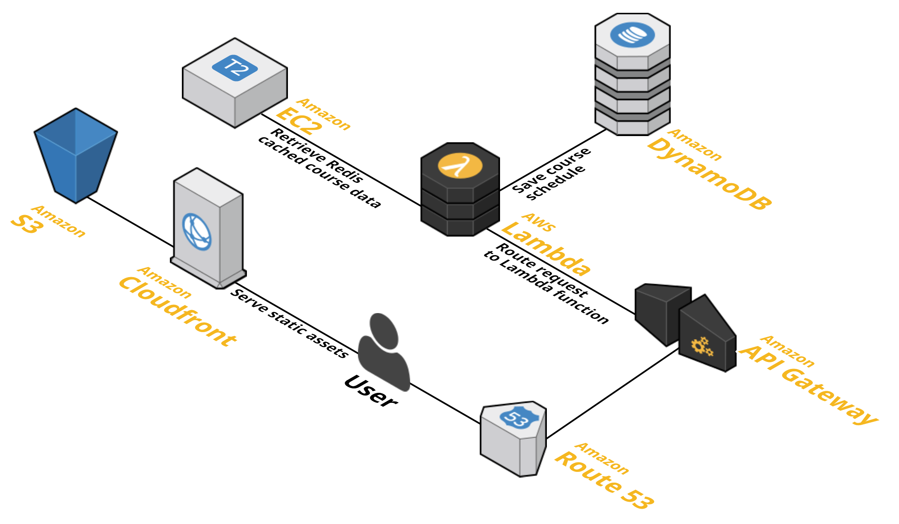

no8am
==================

Help students easily create their course schedules each semester.

Features
-------

* Single-page web interface
* Fast retrieval of course data using a Redis cache
* CDN for static assets through Amazon CloudFront
* Custom links to course schedules using Amazon DynamoDB
* One-line deployment to AWS
* API to support external applications

Develop
-------

It's a good idea to create a [virtualenv](http://docs.python-guide.org/en/latest/dev/virtualenvs/) environment first to avoid installing dependencies globally.

    git clone ssh://git@github.com/nowyasimi/no8am.git && cd no8am
    pip install -r requirements.txt
    npm install
    python run.py

That's it! Open a web browser and go to `localhost:3000`.

API Reference
-------

If you would like to use no8am data in another application, feel free to use this API!

### Course

| Endpoint | Description |
| ---- | --------------- |
| [GET /course](https://no8.am/course) | Get a list of departments |
| [GET /course/:department](https://no8.am/course/CSCI) | Get a list of course data for the department |
| [GET /course/:department/:course_number](https://no8.am/course/CSCI/203) | Get a list of sections for the course |

### Category

| Endpoint | Description |
| ---- | --------------- |
| [GET /category/:category](https://no8.am/category/ccc) | Get a list of lookup options for the category |
| [GET /category/:category/:value](https://no8.am/category/ccc/NSMC) | Get a list of course data for the category |

Keep in mind that this API is not yet versioned and is subject to change at any time.

Deploy
-------

No8am is currently deployed on Amazon Web Services. Full deployment guide coming soon.

Contributing
-------

This project has features that can be developed by students at any level of
CS experience. See the [issues](https://github.com/nowyasimi/no8am/issues)
page for features that are tagged as `easy`.

License
-------

This project is licensed under the terms of the The GNU General Public License v3.0.

> no8am [no8.am](https://no8.am) &nbsp;&middot;&nbsp;
> Nadeem Nasimi [nadeem.io](http://nadeem.io) &nbsp;&middot;&nbsp;
> Github [@nowyasimi](https://github.com/nowyasimi)
